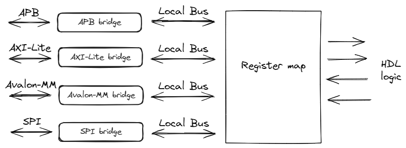

.. _examples:

=======
Примеры
=======

Ряд примеров доступен на GitHub `тут <https://github.com/paulmsv/regmapGen/tree/master/examples>`_ .
Структура генерируемого кода показана ниже. 

Мосты между интерфейсами и внутренней шиной LocalBus регистровой карты генерируется автоматически в зависимости от конфигурационного файла. Кроме того, они могут быть как частью регистровой карты, так и отдельным модулем. Возможна также генерация регистровой карты без мостов (только LocalBus) - для организации собственного интерфейса взаимодействия.

Генерация кода
--------------

Ниже приведены два наиболее распространенных сценария, отличающиеся только тем, где будет сгенерирован Bridge для взаимодействия с LocalBus интерфейсом - внутри модуля с Регистровой картой или в отдельном модуле.

**Сценарий 1**

Генерация SystemVerilog кода Регистровой карты из JSON-файла с AXI-Lite интерфейсом (мост AXI-to-LoculBus внутри)

.. code-block:: ini

    [globcfg]
    base_address = 0
    data_width = 8
    address_width = 8
    register_reset = async_neg
    address_increment = none
    address_alignment = data_width
    force_name_case = none
    regmap_path = regs.json

    [sv_module_1]
    path = hw/regs.sv
    read_filler = 0
    interface = axil
    generator = SystemVerilog

В таргете ``[sv_module_1]`` указан тип интерфейса ``axil``. Поэтому интерфейс шины AXI-Lite вместе с Bridge'ом к LocalBus Регистровой карты будет сгенерирован прямо внутри файла ``regs.sv``.

**Сценарий 2**

Генерация SystemVerilog кода Регистровой карты из YAML-файла с SPI-интерфейсом (мост SPI-to-LoculBus снаружи)

.. code-block:: ini

    [globcfg]
    base_address = 0
    data_width = 16
    address_width = 8
    register_reset = async_neg
    address_increment = none
    address_alignment = data_width
    force_name_case = none
    regmap_path = regs.yaml

    [sv_module_2]
    path = hw/regs.sv
    read_filler = 0
    interface = lb
    generator = SystemVerilog

    [spi2lb_module]
    path = hw/spi2lb_bridge.sv
    bridge_type = spi
    generator = LbBridgeSystemVerilog

В таргете ``[sv_module_2]`` указан тип интерфейса ``lb``. Поэтому внутри файла ``regs.sv`` будет сгенерирована только Регистровая карта с LocalBus интерфейсом. 
При этом в таргет ``[spi2lb_module]`` генератор ``LbBridgeSystemVerilog`` сгенерирует SPI Slave интерфейс вместе с Bridge'ом к LocalBus в отдельном файле ``spi2lb_bridge.sv``.

Генерация документации
----------------------

В примере ниже в таргетах ``[md_doc]`` и ``[asciidoc_doc]`` из YAML-файла сгенерируется документации в Markdown и AsciiDoc форматах, соответственно. 

Таргет ``[docx_doc]`` из сгенерированного Markdown файла сгенерирует Microsoft Word Docx документ. При этом в его опциях указаны LUA-фильтр (для того, чтобы описание каждого регистра начиналось с новой страницы) и Reference-документ (для того, чтобы применить к документу стили, разметку, форматирование и так далее из шаблона ``ref.docx``). Возможны также любые другие аргументы командной строки, поддерживаемые Pandoc.

.. code-block:: ini

    [globcfg]
    base_address = 0
    data_width = 32
    address_width = 16
    register_reset = sync_pos
    address_increment = none
    address_alignment = data_width
    force_name_case = none
    regmap_path = regs.yaml

    [md_doc]
    path = doc/regs.md
    title = Register map
    print_images = True
    image_dir = md_img
    print_conventions = True
    generator = Markdown

    [asciidoc_doc]
    path = doc/regs.adoc
    title = Register map
    print_images = True
    image_dir = adoc_img
    print_conventions = True
    generator = Asciidoc

    [docx_doc]
    path = doc/regs.docx
    name_md = regs.md
    pandoc_args = --lua-filter=pagebreak.lua --reference-doc=ref.docx
    generator = Docx

Для конвертации документов в любой другой формат можно использовать `Pandoc <https://pandoc.org/>`_.

.. code-block:: bash

    pandoc -s regs.md -o regs.pdf

Для конвертации Asciidoc в MS docx формат необходимо сначала использовать утилиту asciidoctor а затем Pandoc:

.. code-block:: bash

    asciidoctor -b docbook -o regs.xml regs.adoc
    pandoc -f docbook -t markdown -o regs.md regs.xml
    pandoc -s regs.md -o regs.docx