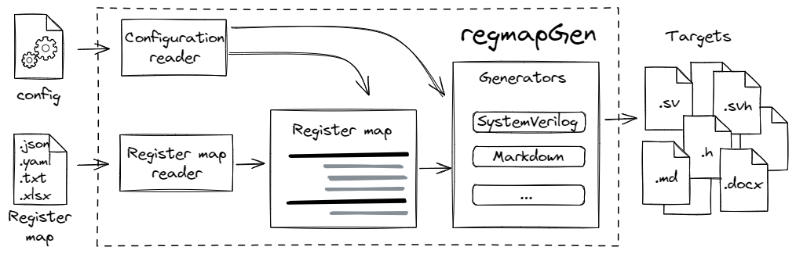

.. _introduction:

========
Введение
========

**regmapGen** - это инструмент, который упрощает создание и поддержку Регистровой Карты для любого проекта на языке описания 
аппаратуры (HDL). Он позволяет описать карту регистров в одном файле, а затем сгенерировать пригодный для синтеза HDL код, 
документацию и другие файлы. Это позволяет эффективно устранять расхождения между различными аспектами разработки ИС - 
hardware, software и документацией, а также автоматизировать процесс разработки, верификации и переиспользования кода IP-блока.

Особенности
===========

* Человеко-читаемые форматы ввода: JSON, YAML, Excel или простая текстовая таблица
* Генерация HDL кода: SystemVerilog модуль с картой регистров + SV wrapper, SV header, SV package
* Генерация UVM регистровой модели для верификации
* Поддержка нескольких протоколов: APB, SPI, AXI-Lite, Avalon-MM или любой пользовательский протокол через LocalBus
* Генерация документации: Markdown, AsciiDoc, Docx, RST, HTML
* Генерация файлов, относящихся к software-части: C header, Python модуль
* Генерация IP-XACT XML и CMSIS SVD описания регистров из Excel таблицы
* Расширяемость: поддержка внешних генераторов
* API: cоздание пользовательского рабочего процесса с помощью API regmapGen

Установка
=========

Установите последнюю стабильную версию из PyPI:

::

    python3 -m pip install -U regmapGen

Использование CLI
=================

CLI (Command Line Interface) - интерфейс командной строки.

Маршрут использования regmapGen:

* опишите вашу Регистровую карту в одном из поддерживаемых форматов (см. :ref:`тут <regmap>`)
* создайте Конфигурационный файл ``config`` (см. :ref:`тут <config>`)
* запустите ``regmapGen`` для генерации всех необходимых файлов

Хорошая отправная точка - сгенерировать шаблоны. Например, для создания шаблона карты регистров в формате YAML просто запустите:

.. code-block:: bash

    regmapGen -t yaml

Вы получите следующую структуру каталогов:

::

    ./config
    ./regs.yaml

Для получения всех сгенерированных файлов просто запустите regmapGen:

.. code-block:: bash

    regmapGen

Вы можете запустить regmapGen из другой директории. Например, если ваш Конфигурационный файл находится в ``project/ip-core/config``:

.. code-block:: bash

    regmapGen project/ip-core

Если ваш ``config`` имеет другое имя, используйте:

.. code-block:: bash

    regmapGen -c my.config

Если ваш ``config`` не содержит определения для пути к Регистровой карте, вы можете указать его явно:

.. code-block:: bash

    regmapGen -r uart.txt

Использование API
=================

Вы можете использовать классы regmapGen для создания собственного рабочего процесса внутри скрипта на Python.
Демонстрация есть на GitHub в `demo <https://github.com/paulmsv/regmapGen/tree/master/examples/api/demo>`_.

Более подробную информацию о внутренних классах можно найти в разделе API:

* :ref:`Configuration <config-api>`
* :ref:`Generators <generators-api>`
* :ref:`Register map <regmap-api>`
