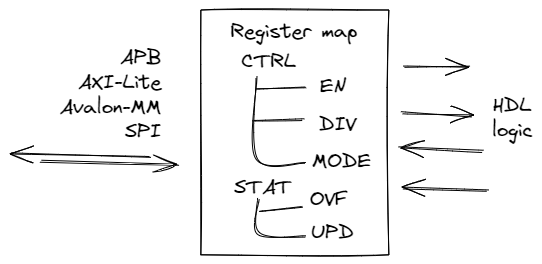

.. _regmap:

=================
Регистровая карта
=================

Регистровая карта - это специальная область памяти, которая состоит из именованных адресов, называемых регистрами, также известных как Регистры Управления и Состояния (Control and Status Registers, CSR).
Эти регистры, в свою очередь, состоят из битовых полей - группы битов с особыми свойствами. При доступе к любому регистру происходит чтение или запись коллекции битовых полей.

Регистровая карта обычно является частью IP-ядра, такого как таймер, UART, SPI, USB, Ethernet и многих других. Ее использует программное обеспечение для управления ядром.

С аппаратной точки зрения типичная карта регистров имеет интерфейс шины (APB, AXI-Lite, Avalon-MM или другой) с одного конца и группу сигналов, которые интегрируют карту с логикой HDL с другого конца.

Регистр
========

Как уже упоминалось, Регистровая карта представляет собой просто набор регистров. 
Регистр имеет 4 основных атрибута:

================== ==============================================================
Параметр           Описание
================== ==============================================================
``name``           Имя регистра
``description``    Описание регистра
``address``        Адрес регистра (смещение от базового адреса Регистровой карты)
``bitfields``      Список битовых полей
================== ==============================================================

Битовое поле
============

На более низком уровне регистр состоит из одного или нескольких битовых полей. Атрибуты битового поля:

=============== ================================================================
Параметр        Описание
=============== ================================================================
``name``        Имя битового поля
``description`` Описания битового поля
``reset``       Значения сброса поля
``width``       Шириня поля (в битах)
``lsb``         Позиция младшего значащего бита (LSB) поля
``access``      Тип доступа. Один из вариантов ниже.
``hardware``    Hardware опция. Опции представлены ниже.
``enums``       Перечисляемые (enumerated) значения поля
=============== ================================================================

Тип доступа для поля связан с доступами к шине из программного обеспечения (software) или от того, кто управляет интерфейсом шины (master). Используйте один из следующих Типов доступа:

=========== =============================================================================================================================
Тип доступа Описание
=========== =============================================================================================================================
``rw``      Read and Write. The field can be read or written.
``rw1c``    Read and Write 1 to Clear. The field can be read, and when 1 is written field is cleared.
``rw1s``    Read and Write 1 to Set The field can be read, and when 1 is written field is set.
``ro``      Read Only. Write has no effect.
``roc``     Read Only to Clear. The field is cleared after every read.
``roll``    Read Only / Latch Low. The field capture hardware active low pulse signal and stuck in 0. The field is set after every read.
``rolh``    Read Only / Latch High. The field capture hardware active high pulse signal and stuck in 1. Read the field to clear it.
``wo``      Write only. Zeros are always read. Can not be used with ``a`` hardware attribute.
``wosc``    Write Only / Self Clear. The field is cleared on the next clock tick after write.
=========== =============================================================================================================================

Hardware опция используется для определения того, как битовое поле будет взаимодействовать с логикой HDL. Используйте одну из следующих Hardware опций:

============== =======================================================================================================
Hardware опция Описание
============== =======================================================================================================
``i``          Input. Use input value from hardware to update the field.
``o``          Output. Enable output value from the field to be accessed by hardware.
``c``          Clear. Add signal to clear the field (fill with all zeros).
``s``          Set. Add signal to set the field (fill with all ones).
``e``          Enable. Add signal to enable the field to capture input value (must be used with i).
``l``          Lock. Add signal to lock the field (to prevent any changes).
``a``          Access. Add signals to notify when bus access to the field is performed
``q``          Queue. Enable queue (LIFO, FIFO) access
``f``          Fixed. Enable fixed mode (field is a constant)
``n``          None. No hardware access to the field.
============== =======================================================================================================

Набор hardware опций представляет собой строку типа ``q``, ``ioel``. Несколько правил для работы с ними:

* Опции ``n``, ``f``, ``q`` можно использовать только отдельно
* Любые комбинации ``i``, ``o``, ``u``, ``c``, ``s``, ``l``, ``a`` разрешение

Вот всего лишь несколько идей о том, как режим доступа к битовому полю и hardware-опции могут быть комбинированы друг с другом. Конечно, полный список возможных комбинаций гораздо больше, но эти варианты охватывают большинство случаев.

======== ======== ==================================================================================================================================================================
Доступ   Опция    Описание
======== ======== ==================================================================================================================================================================
``rw``   ``o``          Values can be read and written from software. Hardware can only access the current value.
``rw``   ``ol``         Value that can be always read, but writing is done only when lock signal is inactive. Hardware can only access the current value.
``rw``   ``ioe``        Values that can be read and written from software. Hardware either can access the current value or update it.
``rw``   ``ioea``       Same as above, but hardware can also track when value was read or written by software.
``rw``   ``oc``         Values that can be read and written from software. Hardware can clean the value.
``rw``   ``os``         Values that can be read and written from software. Hardware can set the value.
``rw``   ``q``          Software can read and write data. Hardware transforms these accesses to the queue read/write operations.
``rw``   ``n``          Software can read and write data. But hardware has no access to the field.
``rw1c`` ``s``          Software can read current state and write 1 to clear the field. Hardware can set the value.
``rw1s`` ``c``          Software can read current state and write 1 to set the field. Hardware can clear the value.
``ro``   ``i``          Software can only read the field. Hardware assign current state to some internal variable.
``ro``   ``f``          Software can only read the constatnt value from the field. Hardware has no access to the field.
``ro``   ``ie``         Software can only read the field. Hardware can update the value when enable signal is active.
``ro``   ``q``          Software can only read data from the field. Hardware transform this to the queue read operation.
``roc``  ``ie``         Software can only read data from the field, field is cleared after read. Hardware can update the value when enable signal is active.
``roll`` ``i``          Value of the field will stuck at 0 when assigned hardware variable becomes 0. Software can only read data from the field, field is set after read.
``rolh`` ``i``          Value of the field will stuck at 1 when assigned hardware variable becomes 1. Software can only read data from the field, field is cleared after read.
``wo``   ``o``          Software can only write the field. Hardware can access the current value.
``wo``   ``q``          Software can only write data to the field. Hardware transform this to the queue write operation.
``wosc`` ``o``          Software can only write the field, the value will be cleared on the next tick. Hardware can access the field.
======== ======== ==================================================================================================================================================================

Перечисляемые значения
======================

Битовое поле может иметь одно или несколько специальных именованных значений, также известных как перечисляемые значения или перечисления (enum).
Фактически, они представляют собой просто мнемоники, присвоенные определенным значениям, которые считываются или записываются в поле.
У каждого перечисляемого значения есть 3 свойства:

=============== ==================
Параметр        Описание
=============== ==================
``name``        Enum имя
``description`` Enum описание
``value``       Enum значения
=============== ==================

Входные форматы
===============

YAML
---------

Пример YAML:

.. code-block:: yaml

    regmap:
    -   name: CTRL
        description: Control register
        address: 8
        bitfields:
        -   name: BAUD
            description: Baudrate value
            reset: 0
            width: 2
            lsb: 0
            access: rw
            hardware: o
            enums:
            -   name: B9600
                description: 9600 baud
                value: 0
            -   name: B38400
                description: 38400 baud
                value: 1
            -   name: B115200
                description: 115200 baud
                value: 2
    -   name: ID
        description: IP-core ID register
        address: 4092
        bitfields:
        -   name: UID
            description: Unique ID
            reset: 3405645414
            width: 32
            lsb: 0
            access: ro
            hardware: f
            enums: []

Больше деталей из примера можно найти в `тут <https://github.com/paulmsv/regmapGen/tree/master/examples/regmap_yaml>`__.

JSON
----

Пример JSON немного более развернут, чем YAML, но это все еще та же карта регистров:

.. code-block:: json

    {
        "regmap":[
            {
                "name": "CTRL",
                "description": "Control register",
                "address": 8,
                "bitfields": [
                    {
                        "name": "BAUD",
                        "description": "Baudrate value",
                        "reset": 0,
                        "width": 2,
                        "lsb": 0,
                        "access": "rw",
                        "hardware": "o",
                        "enums": [
                            {
                                "name": "B9600",
                                "description": "9600 baud",
                                "value": 0
                            },
                            {
                                "name": "B38400",
                                "description": "38400 baud",
                                "value": 1
                            },
                            {
                                "name": "B115200",
                                "description": "115200 baud",
                                "value": 2
                            }
                        ]
                    }
    						]
    		    },
    				{
                "name": "ID",
                "description": "IP-core ID register",
                "address": 4092,
                "bitfields": [
                    {
                        "name": "UID",
                        "description": "Unique ID",
                        "reset": 3405645414,
                        "width": 32,
                        "lsb": 0,
                        "access": "ro",
                        "hardware": "f",
                        "enums": []
                    }
                ]
            }
        ]
    }

Больше деталей из примера можно найти в `тут <https://github.com/paulmsv/regmapGen/tree/master/examples/regmap_json>`__.

TXT
---

Простой текстовый формат, похожий на таблицу Markdown. Пример ниже:

.. code-block:: markdown

    | Address | Name   | Width | Access | Hardware | Reset      | Description      |
    | ------- | ------ | ----- | ------ | -------- | ---------- | ---------------- |
    | 0x0000  | DATA   | 32    | rw     | ioe      | 0x00000000 | Data register    |
    | 0x0004  | CTRL   | 16    | rw     | o        | 0x00000100 | Control register |
    | 0x0008  | STATUS | 8     | ro     | i        | 0x00000000 | Status register  |
    | 0x0100  | START  | 1     | wosc   | o        | 0x00000000 | Start register   |

Этот формат намного проще, чем форматы JSON/YAML, но для многих приложений этого вполне достаточно. Однако за эту простоту приходится платить:

* Разрешено только одно битовое поле на регистр. Колонки Address, Name, Description относятся к аттрибутам регистра. Колонки Width, Access, Hardware, Reset - к битовым полям. Младший значащий бит (LSB) для этого единственного битового поля всегда равен 0.
* Enum не поддерживаются

Больше деталей из примера можно найти в `тут <https://github.com/paulmsv/regmapGen/tree/master/examples/regmap_txt>`__.
